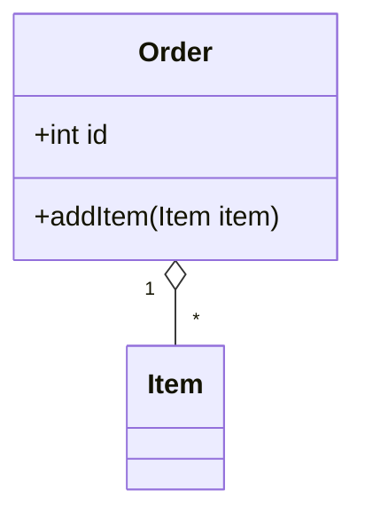

# ООАП. Работа 1

**Тема:**
**Срок сдачи:**

## Постановка задачи

<!-- Своими словами: что требовалось спроектировать -->

## Проектные решения

<!-- Какие классы/абстракции выделены и почему именно так.
     Что рассматривали как альтернативу и почему отказались. -->

## Диаграммы

<!-- Вставьте диаграмму прямо сюда — GitHub рендерит Mermaid в Markdown:


-->

## Как запустить

```bash

```

## Что не получилось / вопросы

